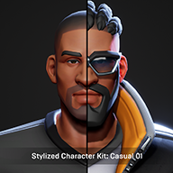

# NEMEMO

**Unreal Engine Open MMORPG FOR LEARNING**



[](https://github.com/AlStartlight/NEMEMO/stargazers)
[](LICENSE)

---

## 📖 Overview

**NEMEMO** is an open-source MMORPG project developed using Unreal Engine 4. It serves as a learning platform for developers interested in understanding the architecture and development of multiplayer online role-playing games. The project emphasizes modular design, networking, and gameplay mechanics, providing a solid foundation for both educational purposes and further development.

---

## 🚀 Features

- **Multiplayer Support**: Implemented using Unreal Engine's networking capabilities.
- **Modular Architecture**: Organized codebase for scalability and maintainability.
- **Custom Character System**: Includes character creation and customization features.
- **Quest and Inventory Systems**: Basic implementations to demonstrate core RPG mechanics.
- **Open World Environment**: Sample maps and assets to illustrate world-building techniques.

---

## 🛠️ Getting Started

### Prerequisites

- **Unreal Engine 4.27** or later
- **Visual Studio 2019** or later (for Windows)
- **Git** for version control

### Installation

1. **Clone the Repository**:
   ```bash
   git clone https://github.com/AlStartlight/NEMEMO.git

## ScreenShoot
!https://media.licdn.com/dms/image/v2/D562DAQHtBqKddVeZsA/profile-treasury-image-shrink_800_800/profile-treasury-image-shrink_800_800/0/1687796521426?e=1749639600&v=beta&t=_z_K1pBfdtvKZRgA_eUzCF3QJ2bMOsin-ftw_ie1Wro

